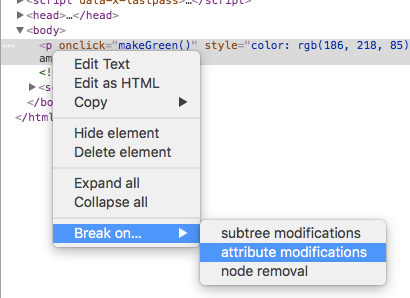

# Key Points

## Break on...



## Console logging flavours

```js
// Clear
console.clear();

// Regular
console.log('Hello world');

// Interpolated
console.log('Hello world %s', '👋 🌏');

// Styled
console.log('%c Hello world', 'font-size:26px; color:red; font-weight: bold')

// Warning
console.warn('Yellow Warning'); // displays stacktrace

// Error
console.error('Red Error'); // displays stacktrace

// Info
console.info('Blue info');

// Table
console.table(dogs);

// Assert
// console.assert(condition, message), will only display if condition is falsey
console.assert(paragraph.classList.contains('ouch'), 'Could not find classname applied');

// Viewing DOM Elements
console.dir(paragraph);

// Grouping together
dogs.forEach(dog => {
  console.groupCollapsed(`${dog.name}`); // also console.group to make it start off expanded
  console.log(dog);
  console.groupEnd(`${dog.name}`);
});

// Counting
console.count('Wes');
console.count('Wes');
console.count('Steve');
console.count('Steve');
console.count('Wes');

// Timing
console.time('fetching data');
fetch('https://api.github.com/users/wesbos')
  .then(response => response.json())
  .then(data => {
    console.timeEnd('fetching data');
  });

// Table formatted data
console.table(dogs);
```
